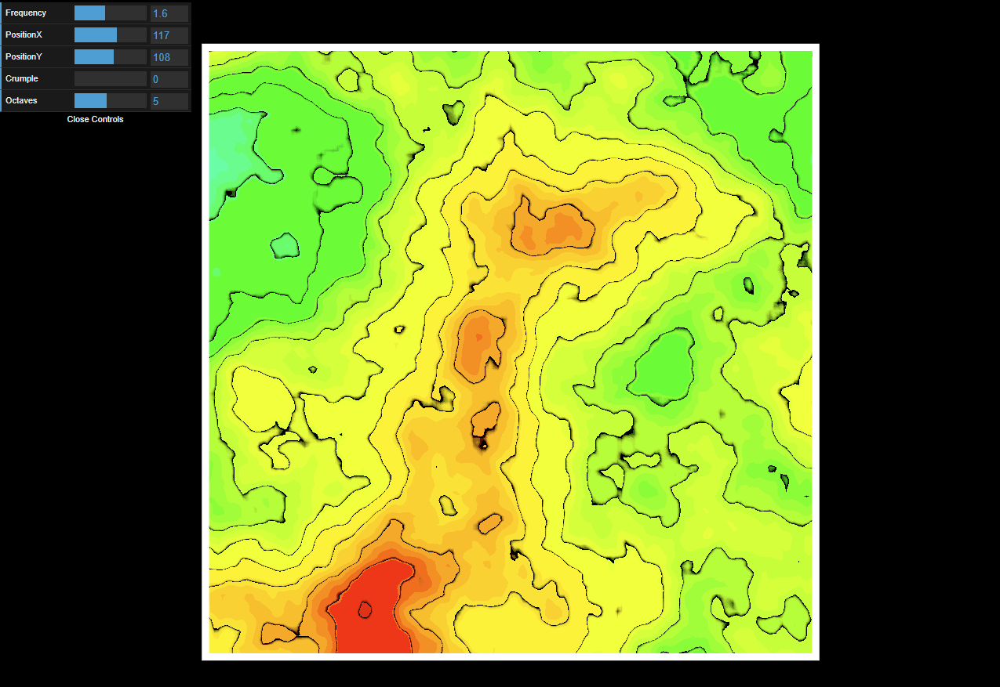

# Readme

WebGL based procedural heightmap map I wrote back in year 2016.
You can test it here <https://jimli570.github.io/web-procedural-height-map/> .

## Libraries in use

- Dat.gui <https://github.com/dataarts/dat.gui>
- OrbitControls <https://threejs.org/docs/#examples/en/controls/OrbitControls>
- ThreeJS <https://threejs.org/>
